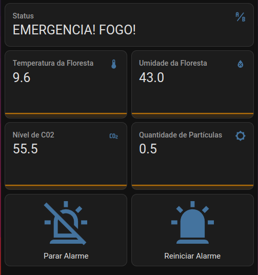

# Portfólio Pessoal

## Experiência Criativa: Navegando na Computação
Durante a disciplina de Experiência Criativa, realizamos três projetos principais que abordaram diferentes aspectos da criatividade e do desenvolvimento tecnológico. Estes projetos nos permitiram aplicar conceitos teóricos na prática, desenvolvendo habilidades em design de jogos, desenvolvimento de aplicativos e criação de sites.

### Jogo: Flashing Lights
O primeiro projeto foi a criação de um jogo utilizando a plataforma Construct. O nome do nosso jogo foi **Flashing Lights**. Ele se passa em um futuro distópico onde a música foi banida, e o personagem principal tenta recuperar a música em todas as suas formas.

  
  

### Aplicativo Multimídia: Entendendo Logaritmos
O segundo projeto foi um aplicativo que facilitava o entendimento de logaritmos na matemática. Utilizamos o Processing para criar uma aplicação dividida em duas partes: a primeira explicava detalhadamente o conceito de logaritmo, e a segunda continha um quiz para testar o conhecimento.

  

### Desenvolvimento Web: Crazy Cat Gang
O terceiro projeto foi a criação de um site para a ONG “Crazy Cat Gang”. O objetivo era desenvolver soluções para problemas apresentados pela organização. Abaixo é possível ver a tela inicial e algumas outras telas do nosso site.

---

## Resolução de Problemas com Lógica Matemática
Na disciplina de Lógica Computacional, focamos principalmente na Lógica Proposicional, que é um ramo da lógica que lida com proposições e seus conectivos lógicos. 

### Conectivos Lógicos
- **Conjunção ( ^ )**: Representa "e".
- **Disjunção ( v )**: Representa "ou".
- **Implicação ( -> )**: Representa "se... então".
- **Bicondicional ( <-> )**: Representa "se e somente se".
- **Negação ( ~ )**: Representa "não".

### Tabela Verdade
A tabela verdade é uma ferramenta utilizada para determinar a veracidade das proposições lógicas.

  

### Equivalências e Regras de Inferência
Equivalências são expressões lógicas que sempre têm o mesmo valor de verdade. Regras de inferência são utilizadas para deduzir novas proposições a partir de proposições já conhecidas.

  
  

  

---

## Fundamentos de Sistemas Ciberfísicos
Nesta disciplina, abordamos diversos conceitos fundamentais para a compreensão e o desenvolvimento de sistemas ciberfísicos.

### Bases Numéricas
Exploramos diferentes bases numéricas como hexadecimal, binário e octal, essenciais para a representação de dados em sistemas computacionais.

### Operações Aritméticas
Realizamos operações de soma e subtração nessas diferentes bases numéricas.

### Máquina de Turing
Estudamos o conceito de Máquina de Turing, um modelo teórico de computação que define o que significa uma função ser computável.

### Sistemas Operacionais: Windows Vista
Analisamos sistemas operacionais, com um foco especial no Windows Vista.

<iframe width="560" height="315" src="https://www.youtube.com/embed/K7oa33jKkzc?si=-b8RpXobgzddjJu5" title="YouTube video player" frameborder="0" allow="accelerometer; autoplay; clipboard-write; encrypted-media; gyroscope; picture-in-picture; web-share" referrerpolicy="strict-origin-when-cross-origin" allowfullscreen></iframe>

### Arquiteturas RISC vs CISC
Comparação entre as arquiteturas RISC (Reduced Instruction Set Computing) e CISC (Complex Instruction Set Computing), destacando suas características e aplicações.

### ESP32 e MQTT
Aprendemos sobre o microcontrolador ESP32 e o protocolo de comunicação MQTT, essenciais para o desenvolvimento de sistemas de IoT (Internet of Things).

  

  

