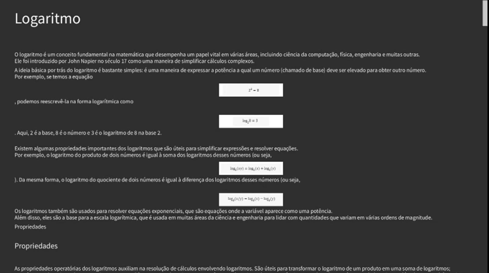
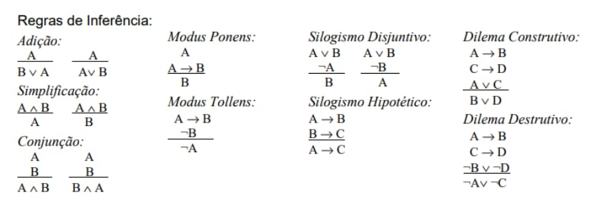

# Portfólio Pessoal

## Experiência Criativa: Navegando na Computação
Durante a disciplina de Experiência Criativa, realizamos três projetos principais. Um jogo, um aplicativo multimídia e um site para uma ONG.

### Jogo: Flashing Lights
O primeiro projeto foi a criação de um jogo utilizando a plataforma Construct. O nome do nosso jogo foi **Flashing Lights**. Ele se passa em um futuro distópico onde a música foi banida, e o personagem principal tenta recuperar a música em todas as suas formas. Foi utilizado o Construct, que é uma plataforma para se criar jogos 2D e 3D.

  
  

### Aplicativo Multimídia: Entendendo Logaritmos
O segundo projeto foi um aplicativo que facilitava o entendimento de logaritmos na matemática. O aplicativo ficou dividido em duas partes: a primeira explica detalhadamente o conceito de logaritmo, e a segunda tem um quiz para testar o conhecimento. Foi utilizado o Processing como uma IDE para criar a interface gráfica.

  

### Desenvolvimento Web: Crazy Cat Gang
O terceiro projeto foi a criação de um site para a ONG “Crazy Cat Gang”. O objetivo era desenvolver soluções para problemas apresentados pela organização. Nós utilizamos, principalmente, o HTML e PHP para comunicar com um banco de dados. Além disso, foi utilizado o JS e CSS, para formatação e mais alguns scripts. Abaixo é possível ver a tela inicial e algumas outras telas do nosso site.

  
  

  
  

---

## Resolução de Problemas com Lógica Matemática
Na disciplina de Lógica Computacional, focamos principalmente na Lógica Proposicional, que é um ramo da lógica que lida com proposições e seus conectivos lógicos. 

### Conectivos Lógicos
- **Conjunção ( ^ )**: Representa "e".
- **Disjunção ( v )**: Representa "ou".
- **Implicação ( -> )**: Representa "se... então".
- **Bicondicional ( <-> )**: Representa "se e somente se".
- **Negação ( ~ )**: Representa "não".

### Tabela Verdade
A tabela verdade é uma ferramenta utilizada para determinar a veracidade das proposições lógicas.

  

### Equivalências e Regras de Inferência
Equivalências, como já diz o nome, é uma maneira de simplificar expressões lógicas trocando por suas equivalências. Já as regras de inferência são utilizadas para deduzir novas proposições a partir de proposições já conhecidas.

  
  

  

---

## Fundamentos de Sistemas Ciberfísicos
Nesta disciplina, nós vimos os fundamentos da computação. Desde como funciona a contagem em diferentes bases, até as arquiteturas de CPUs e sistemas operacionais.

### Bases Numéricas
Exploramos diferentes bases numéricas como hexadecimal, binário e octal, essenciais para a representação de dados em sistemas computacionais.

### Máquina de Turing
Foi visto também o paradigma da máquina de turing. Que foi uma das grandes invenções da computação e realmente mudou o mundo. Nós vimos que com poucas regras e instruções é possível fazer muitas coisas.

  

### Sistemas Operacionais: Windows Vista
Nós fizemos um relatório sobre o Windows Vista, explicando as vantagens e desvantagens dele. Além disso foi explicado detalhadamente (em relação ao Vista) como funciona a CPU, sistemas de arquivos e segurança. Abaixo está o vídeo da nossa apresentação.

<iframe width="560" height="315" src="https://www.youtube.com/embed/K7oa33jKkzc?si=-b8RpXobgzddjJu5" title="YouTube video player" frameborder="0" allow="accelerometer; autoplay; clipboard-write; encrypted-media; gyroscope; picture-in-picture; web-share" referrerpolicy="strict-origin-when-cross-origin" allowfullscreen></iframe>

### ESP32 e MQTT
E o último conteúdo que nós vimos foi o IOT (Internet of Things), e foi utilizado o simulador Wokwi para criar um projeto com o ESP32. O nosso projeto foi um alarme sonoro, visual e em MQTT para incêndios florestais.

  

  

